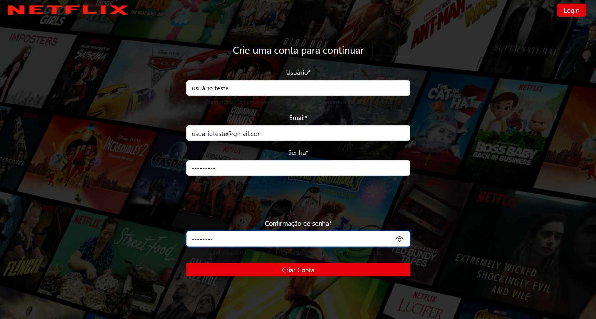
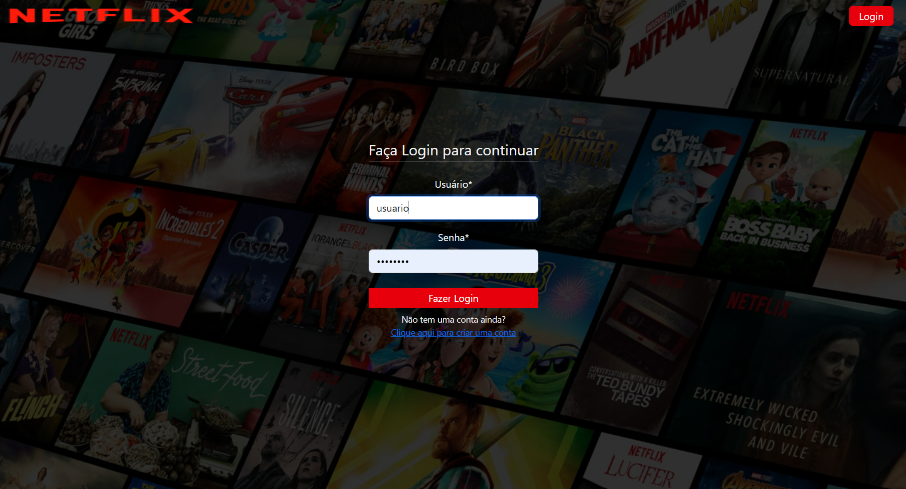

# Projeto Netflix com Django

Projeto desenvolvido para praticar **desenvolvimento web com Python e Django**, criando uma plataforma de filmes e séries inspirada em serviços de streaming.

## Sobre o projeto

A aplicação permite que usuários criem uma conta, façam login e naveguem por filmes e séries cadastrados na plataforma.

O projeto foi desenvolvido com foco em colocar em prática conceitos importantes do Django, como:

* Autenticação de usuários
* Modelos e relacionamentos
* Class-Based Views (CBV)
* Formulários
* Templates
* Sistema de pesquisa
* Controle de visualizações
* Perfil do usuário
* Organização de aplicações Django

## Funcionalidades


<details> 
<summary>👤 Criação de conta</summary>
  <p align="center">
  
  </p>
</details>

<details> 
<summary>🔐 Login e logout</summary>
  <p align="center">
  
  </p>
  <p align="center">
  
  </p>
</details>


* 🎬 Listagem de filmes
* 🔎 Pesquisa por filmes
* 📖 Página de detalhes
* ▶️ Episódios relacionados aos filmes
* 👁️ Contagem de visualizações
* 📌 Registro dos filmes assistidos
* 👤 Edição do perfil
* 🔑 Alteração de senha
* 📂 Categorias de filmes

## Tecnologias utilizadas

* **Python**
* **Django**
* **SQLite**
* **Bootstrap**
* **Tailwind CSS**
* **HTML**
* **CSS**
* **JavaScript**
* **Gunicorn**
* **WhiteNoise**

## Objetivo

Este projeto faz parte do meu processo de aprendizado em **desenvolvimento Web com Python e Django**.

O objetivo principal é transformar os conhecimentos adquiridos em projetos práticos e evoluir gradualmente a aplicação, aplicando boas práticas de desenvolvimento e arquitetura.

## Como executar o projeto

Clone o repositório:

```bash
git clone https://github.com/EdsonSantos-lab/Projeto_netflix_com_django.git
```

Entre na pasta:

```bash
cd Projeto_netflix_com_django
```

Crie um ambiente virtual:

```bash
python -m venv venv
```

Ative o ambiente virtual.

**Windows:**

```bash
venv\Scripts\activate
```

**Linux/macOS:**

```bash
source venv/bin/activate
```

Instale as dependências:

```bash
pip install -r requirements.txt
```

Execute as migrações:

```bash
python manage.py migrate
```

Inicie o servidor:

```bash
python manage.py runserver
```

Depois, acesse:

```text
http://127.0.0.1:8000/
```


